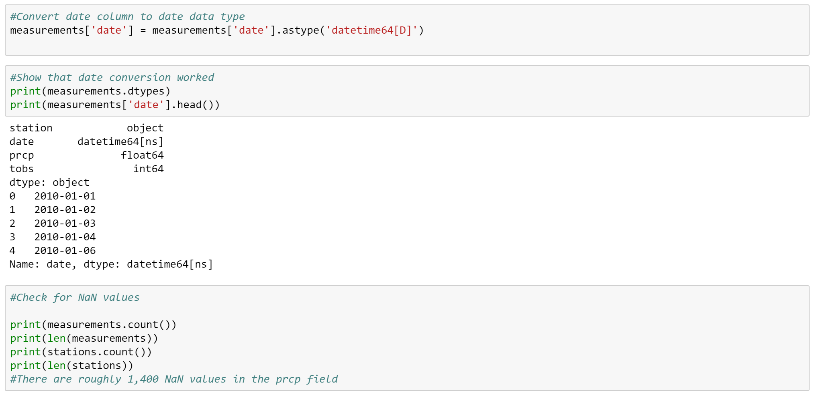
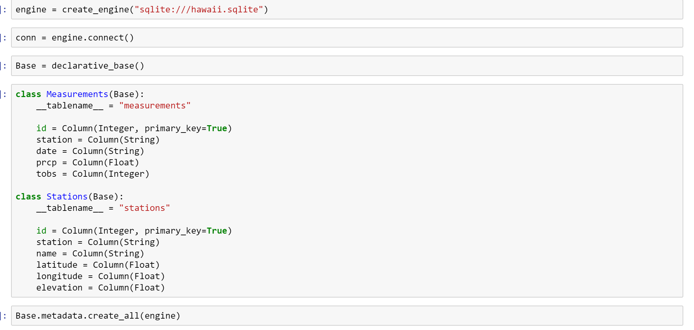
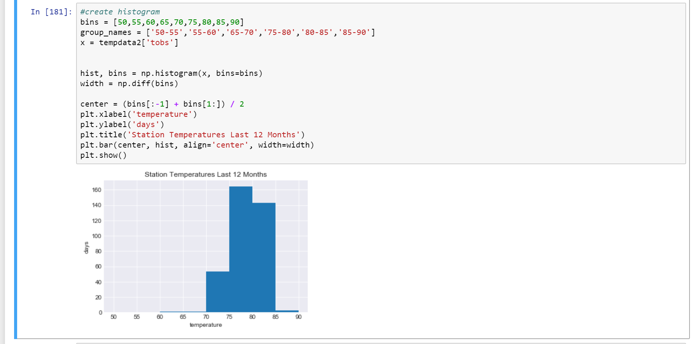

<!--lint disable no-heading-punctuation-->
# Surfs Up!
<!--lint enable no-heading-punctuation-->

Congratulations! You've decided to treat yourself to a long holiday vacation in Honolulu, Hawaii! To help with your trip planning, you decided to do some climate analysis on the area. Because you are such an awesome person, you have decided to share your ninja analytical skills with the community by providing a climate analysis api. The following outlines what you need to do.

## Step 1 - Data Engineering

* In this step, I cleaned up the files from the two CSV files to get the measurement and station data and saved them with the clean_ pre-fix
* Cleanup steps involve coercing the datatype from string to datetime.

---

## Step 2 - Database Engineering

* This step involved using the ORM to create tables and declaring table schemas based off the data retrieved from part 1) data engineering. Below is an example of determining table names and specifying data types in the tables.

---

## Step 3 - Climate Analysis and Exploration

* This step involved taking the data via the ORM and analyzing via Python libraries Matplotlib, Seaborn and Pandas.
* Since the tables were already declared in Step 2) database_engineering, I do not have to declare the table schema. I can use auto_map to reference the data.
* I used Pandas to read the data into a dataframe, then used Matplotlib to visualize my findings.

## Temperature Analysis and Station by Year

### Temperature Analysis

* Here I wrote a function that grabs date inputs and provides min, max, and average temperature data.

### Optional Recommended Analysis

* Not a part of my analysis.
---

## Step 4 - Climate App

* See app.py

### Routes

* `/api/v1.0/precipitation`

  * Returns date and temperature values in a JSON format

* `/api/v1.0/stations`

  * Return a json list of stations from the dataset.

* `/api/v1.0/tobs`

  * Return a json list of Temperature Observations (tobs) for the previous year

* `/api/v1.0/<start>` and `/api/v1.0/<start>/<end>`

  * Include in the URL the start and end dates to return a temperature statistic of that range (min,max,average).

